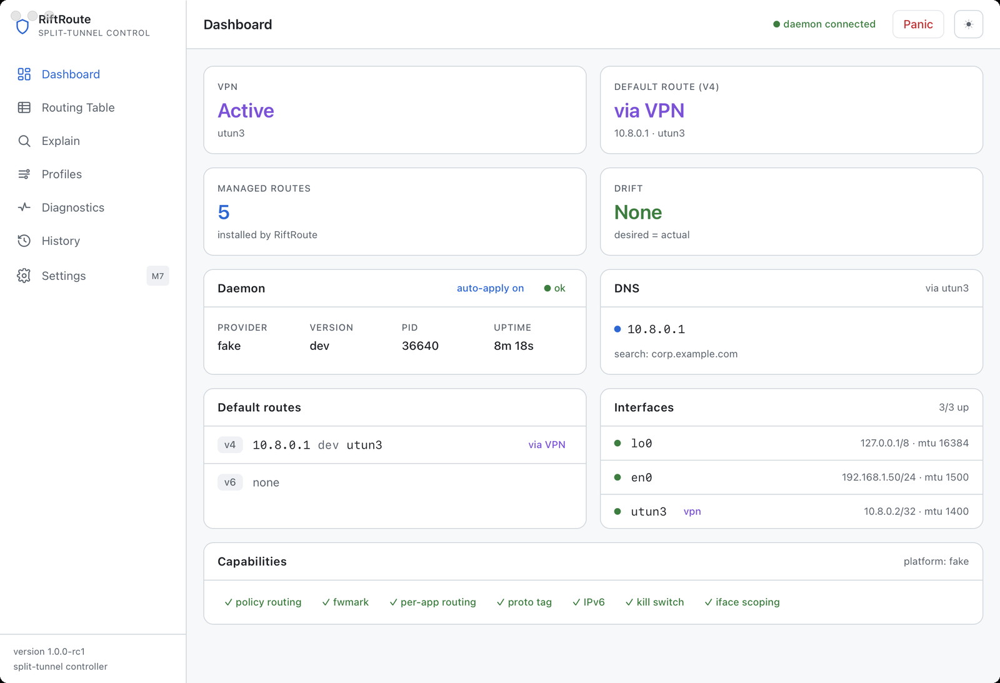

# RiftRoute

[](https://github.com/Amirhat/riftroute/actions/workflows/ci.yml)
[](LICENSE)


[](https://github.com/Amirhat/riftroute/actions/workflows/release.yml)

**Split-tunneling / policy-based routing controller for macOS & Linux.**

RiftRoute lets you say *"these destinations bypass the VPN, everything else goes
through it"* (or the inverse), organize those destinations into toggleable
profiles and lists, and have the system keep the routing table correct
automatically as the VPN goes up/down and the network changes — **without ever
leaving the machine in a broken network state.**

> Status: **M0–M7 feature-complete.** Read-only core, the full safety apparatus,
> auto-apply, advanced routing (CIDR aggregation, conflicts, Linux Model B
> include mode), domains & subscribable lists, power features (kill switch,
> doctor, leak detector, flow monitor, per-app routing, split-DNS), and the
> ship surface (TUI, tray, packaging, update check, CI/release) are all in.



## Two non-negotiable pillars

- **Safety** — every route change goes through the Apply Protocol: snapshot →
  reconcile → dry-run → arm watchdog → atomic apply with precomputed inverse →
  verify → commit-confirm → rollback. Changes are ownership-scoped (RiftRoute
  never touches routes it didn't create). A bug degrades to *"no change"* or
  *"auto-reverted"*, never to *"user has no network"*.
- **Observability** — a routing-table viewer, a route-explain simulator
  (*"where does traffic to X go, and why?"*), a desired-vs-actual diff, a leak
  detector, a live flow monitor, and an audit timeline. The operator is never
  confused.

## Architecture

```
RiftRoute.app (Wails/React)  ─┐
riftroute-tray (menu bar)    ─┤
                              ├─ HTTP/JSON + SSE over a Unix domain socket ─►  riftrouted (root)
riftroute  CLI (cobra)       ─┘        (peer-credential authz)                 owns all route mutation
```

- **`riftrouted`** — the persistent, privileged daemon; the **only** root
  component. Owns route mutation, network monitoring, reconciliation, snapshots,
  the watchdog, persistence (pure-Go SQLite), and the local API.
- **`riftroute`** — unprivileged CLI; `--json` everywhere, stable exit codes.
- **`RiftRoute.app`** — unprivileged Wails GUI. Its Go side holds the daemon
  connection and re-emits updates to React as Wails events; React never speaks
  HTTP/SSE/sockets directly. Closing the GUI does **not** stop routing.
- **`riftroute-tray`** — optional menu-bar companion for quick toggles + Panic.

See [`riftroute-spec.md`](riftroute-spec.md) for the full spec and
[`AGENTS.md`](AGENTS.md) for the desktop/shell/build rules.

## Features

| Area | What you get |
|------|--------------|
| Routing models | Exclude (Model A: host/CIDR routes) and Include (Linux **Model B**: dedicated table `5252` + `ip rule … proto riftroute`) |
| Rules | `cidr`, `ip`, `domain` (re-resolved on a schedule), `asn`/`country` (with a MaxMind MMDB), `app` (Linux cgroup + fwmark) |
| Lists | Inline static + subscribable remote lists (HTTPS-only, size-capped, checksummed, never executed) |
| Safety | Watchdog, commit-confirm with auto-revert, atomic apply + precomputed inverse, ownership reconcile on crash, guardrails |
| Kill switch | Default-drop egress fence (nftables on Linux / pf on macOS) with a reconnect allow-list |
| Diagnostics | `doctor` battery, IPv6 + DNS **leak detector**, desired-vs-actual **drift**, conflict/overlap detection, MTU/blackhole check |
| Observability | Live **flow monitor** (which connections go via VPN vs direct), route-explain (LPM simulator), audit timeline, `watch` TUI |
| DNS | Per-domain **split-DNS** (macOS scoped resolvers / Linux resolvectl) |
| Ship | `update` check, menu-bar tray, `.dmg`/`.deb`/AppImage/Homebrew packaging, tag-driven release CI |

## Prerequisites

- **Go 1.25+** (a transitive dep requires it; the toolchain auto-downloads).
- **Node 20+** and **npm** (for the GUI frontend).
- **Wails v2.12**: `go install github.com/wailsapp/wails/v2/cmd/wails@v2.12.0`
- **macOS**: Xcode Command Line Tools. **Linux**: `libgtk-3-dev`,
  `libwebkit2gtk-4.1-dev` (build the GUI with `-tags webkit2_41`); the tray also
  needs `libayatana-appindicator3-dev`.

## Build & run

```bash
make build           # daemon + CLI -> ./bin (cgo-free)
make run-daemon      # run riftrouted on a dev socket with the fake provider
./bin/riftroute --socket /tmp/riftroute-dev.sock status   # talk to it

make dev             # GUI with hot reload (wails dev)
make desktop         # build RiftRoute.app / native binary
make tray            # build the menu-bar companion (cgo + native tray libs)
make test            # daemon/CLI/engine tests
make cross           # prove every target compiles (incl. Windows fallback)
```

`-provider fake` (the default) runs the whole UI/CLI/daemon spine with **no root
and no real network** — every mutation is simulated. `-provider auto` selects the
real per-OS backend.

### Try it yourself (safe, no root)

Start the daemon with **no flags** so it listens on the per-user socket; the CLI
**and** the GUI then auto-connect to it — no `--socket` and no env needed:

```bash
make build && make desktop

# Terminal 1 — daemon on the fake provider (no root, no real network):
./bin/riftrouted -provider fake

# Terminal 2 — drive it with the CLI:
./bin/riftroute status
./bin/riftroute apply examples/quickstart.yaml --dry-run   # preview the plan
./bin/riftroute apply examples/quickstart.yaml --yes        # apply (simulated)
./bin/riftroute doctor          # diagnostics + leak detector
./bin/riftroute watch           # live TUI

# Open the desktop app — it connects to the same daemon automatically:
open ./desktop/build/bin/RiftRoute.app
```

Everything is simulated on `-provider fake`, so it's completely safe to explore —
nothing touches your real routing table, firewall, or DNS. To point the GUI/CLI
at a specific daemon instead, set `RIFTROUTE_SOCKET=/path/to.sock`.

## Configuration

RiftRoute is driven by a declarative, git-committable file (YAML or TOML).
Validate it (`riftroute apply --dry-run config.yaml`) or apply it
(`riftroute apply config.yaml`). Example:

```yaml
version: 1
settings:
  ip_version: [v4, v6]
  default_mode: exclude
  kill_switch: false
  connectivity_guard:
    enabled: true
    anchors: [gateway]         # or explicit IPs
    confirm_timeout: 15s
    guard_window: 30s
  split_dns:
    - domain: corp.example.com
      resolver: 10.0.0.53
lists:
  - name: corp-nets
    static: [10.0.0.0/8, 192.168.0.0/16]
  - name: ad-block
    source: https://example.com/blocklist.txt   # https only, checksummed
    refresh: 24h
profiles:
  - name: work
    enabled: true
    mode: exclude              # work traffic bypasses the VPN
    lists: [corp-nets]
    rules:
      - { type: domain, value: intranet.example.com }
  - name: only-stream
    enabled: false
    mode: include              # ONLY these go through the tunnel (Linux Model B)
    rules:
      - { type: cidr, value: 198.51.100.0/24 }
      - { type: app,  value: firefox }   # marked traffic → tunnel table
```

## CLI

```
riftroute status                 # health, VPN, drift, profiles
riftroute table show [--managed|--system|--conflicts] [-6]
riftroute route explain <ip|host>   # where does traffic to X go, and why
riftroute diff                   # desired vs actual (exit 0/nonzero)
riftroute flows [--vpn]          # active connections: via VPN or direct
riftroute doctor                 # diagnostics battery (exit 6 on failure)
riftroute watch                  # live TUI
riftroute profile <enable|disable> <name> [--apply]
riftroute apply [file] [--dry-run] [--yes]
riftroute killswitch <on|off|status>
riftroute list <list|refresh>
riftroute snapshot ...           # inspect saved snapshots
riftroute panic                  # flush all managed routes immediately
riftroute update                 # check GitHub Releases for a newer build
riftroute daemon <install|...>   # manage the privileged service
riftroute version
```

Exit codes: `0` ok · `3` daemon unreachable · `4` guardrail refusal · `5`
rolled back · `6` doctor failure. `--json` works on every command.

## Install

### macOS
The GUI ships as `RiftRoute.dmg`. **Developer ID signed + notarized** builds open
with no prompts. Unsigned/ad-hoc builds require **right-click → Open** once (or
`xattr -dr com.apple.quarantine RiftRoute.app`). The CLI + daemon are also
available via Homebrew:

```bash
brew install Amirhat/tap/riftroute
sudo riftroute daemon install        # installs the launchd unit (privileged)
```

### Linux
```bash
sudo dpkg -i riftroute_<ver>_amd64.deb   # CLI + daemon + systemd unit
sudo systemctl enable --now riftroute
# GUI: run the portable RiftRoute-<ver>-x86_64.AppImage
```

The daemon (`riftrouted`) is the only privileged component; it never mutates
routes without the Apply Protocol's guardrails.

## Updating

`riftroute update` reports whether a newer release exists. Applying an update is
deliberate and verified, not silent: download the signed asset for your
platform, verify its SHA-256 against the release `checksums.txt`, then reinstall
(Homebrew/dpkg/dmg). RiftRoute never self-replaces a running privileged binary.

## Packaging & release

`make dist` cross-compiles CLI+daemon tarballs (darwin/linux × amd64/arm64) and
writes `checksums.txt`. `make package-deb`, `package-dmg`, `package-appimage`
build the OS packages. Pushing a `vX.Y.Z` tag runs
[`.github/workflows/release.yml`](.github/workflows/release.yml): it always
builds the core + `.deb` + checksums and the AppImage, builds a **signed +
notarized** `.dmg` when the Apple secrets are present (otherwise an unsigned one),
and publishes a GitHub Release. The Homebrew formula is bumped from the
checksums via [`scripts/bump-homebrew.sh`](scripts/bump-homebrew.sh).

Signing/notarization secrets: `MAC_CERT_P12`, `MAC_CERT_PASSWORD`,
`MAC_SIGN_IDENTITY`, and `AC_APPLE_ID`/`AC_TEAM_ID`/`AC_PASSWORD`.

## Development

- `make test` — Go unit/integration tests (fake provider, race-clean).
- `make cross` — every target compiles, cgo-free.
- Linux netns suite (`test/netns`, `-tags netns`) exercises the real `ip`
  command inside an isolated namespace under CI (apply+confirm, watchdog
  rollback, panic idempotence, Model B include, kill switch, fwmark rule).
- Frontend: `cd desktop/frontend && npm test` (Vitest + jsdom smoke tests).

CI ([`.github/workflows/ci.yml`](.github/workflows/ci.yml)) runs the Go tests
(race), the real end-to-end suite (`test/e2e`), the Linux netns suite, cgo-free
cross builds, the native GUI builds, and the frontend smoke tests.

See [`CONTRIBUTING.md`](CONTRIBUTING.md) for the full dev/test/build workflow.

## Safety model in one paragraph

Routes RiftRoute installs are tagged as its own (`proto riftroute` on Linux; an
ownership map on macOS), so it only ever touches what it created. Each apply
snapshots the affected state and precomputes an exact inverse; it arms a watchdog
that probes anchor reachability and, on an interactive apply, requires a
commit-confirm — if connectivity drops or you don't confirm in time, the change
auto-reverts atomically. A daemon crash mid-transaction is repaired by an
ownership reconcile on startup. The kill switch fails closed but always keeps a
reconnect path (loopback, tunnel, gateway/LAN, DHCP) open.

## Contributing

Contributions are welcome — see [`CONTRIBUTING.md`](CONTRIBUTING.md) for the dev
environment, the build/test workflow, code conventions, and the host-safety
rules. Please also read the [Code of Conduct](CODE_OF_CONDUCT.md). Architecture
and behavior are specified in [`riftroute-spec.md`](riftroute-spec.md) (source of
truth) and [`AGENTS.md`](AGENTS.md).

## Security

RiftRoute runs a privileged daemon; please report vulnerabilities privately as
described in [`SECURITY.md`](SECURITY.md) — do not open a public issue.

## License

[MIT](LICENSE) © AmirHat
