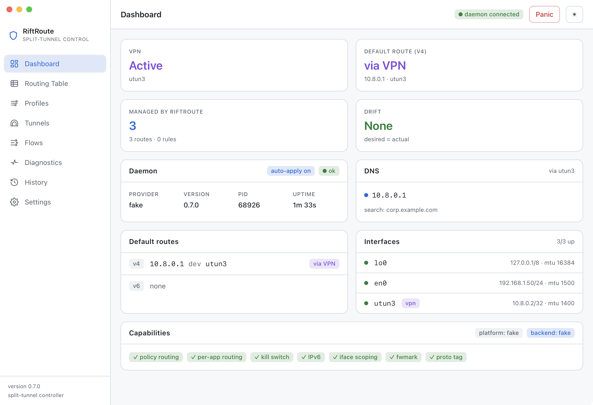

# RiftRoute

[](https://github.com/Amirhat/riftroute/actions/workflows/ci.yml)
[](LICENSE)


[](https://github.com/Amirhat/riftroute/actions/workflows/release.yml)

**Split-tunneling / policy-based routing controller for macOS & Linux.**

RiftRoute lets you say *"these destinations bypass the VPN, everything else goes
through it"* (or the inverse), organize those destinations into toggleable
profiles and lists, and have the system keep the routing table correct
automatically as the VPN goes up/down and the network changes — **without ever
leaving the machine in a broken network state.**

> Status: **M0–M7 feature-complete.** Read-only core, the full safety apparatus,
> auto-apply, advanced routing (CIDR aggregation, conflicts, Linux Model B
> include mode), domains & subscribable lists, power features (kill switch,
> doctor, leak detector, flow monitor, per-app routing, split-DNS), and the
> ship surface (TUI, tray, packaging, update check, CI/release) are all in.



## Two non-negotiable pillars

- **Safety** — every route change goes through the Apply Protocol: snapshot →
  reconcile → dry-run → arm watchdog → atomic apply with precomputed inverse →
  verify → commit-confirm → rollback. Changes are ownership-scoped (RiftRoute
  never touches routes it didn't create). A bug degrades to *"no change"* or
  *"auto-reverted"*, never to *"user has no network"*.
- **Observability** — a routing-table viewer, a route-explain simulator
  (*"where does traffic to X go, and why?"*), a desired-vs-actual diff, a leak
  detector, a live flow monitor, and an audit timeline. The operator is never
  confused.

## Architecture

```
RiftRoute.app (Wails/React)  ─┐
riftroute-tray (menu bar)    ─┤
                              ├─ HTTP/JSON + SSE over a Unix domain socket ─►  riftrouted (root)
riftroute  CLI (cobra)       ─┘        (peer-credential authz)                 owns all route mutation
```

- **`riftrouted`** — the persistent, privileged daemon; the **only** root
  component. Owns route mutation, network monitoring, reconciliation, snapshots,
  the watchdog, persistence (pure-Go SQLite), and the local API.
- **`riftroute`** — unprivileged CLI; `--json` everywhere, stable exit codes.
- **`RiftRoute.app`** — unprivileged Wails GUI. Its Go side holds the daemon
  connection and re-emits updates to React as Wails events; React never speaks
  HTTP/SSE/sockets directly. Closing the GUI does **not** stop routing.
- **`riftroute-tray`** — optional menu-bar companion for quick toggles + Panic.

See [`riftroute-spec.md`](riftroute-spec.md) for the full spec and
[`AGENTS.md`](AGENTS.md) for the desktop/shell/build rules.

## Features

| Area | What you get |
|------|--------------|
| Routing models | Exclude (Model A: host/CIDR routes) and Include — Linux **Model B** (dedicated table `5252` + `ip rule … proto riftroute`) or macOS **PF `route-to`** anchors (the Darwin analogue; policy routing + per-app parity) |
| Rules | `cidr`, `ip`, `domain` (re-resolved on a schedule), `asn`/`country` (with a MaxMind MMDB), `app` (Linux cgroup + fwmark; macOS PF match on uid/user) |
| Lists | Inline static + subscribable remote lists (HTTPS-only, size-capped, checksummed, never executed) |
| Safety | Watchdog, commit-confirm with auto-revert, atomic apply + precomputed inverse, ownership reconcile on crash, guardrails |
| Tunnels | Run an OpenVPN profile or a WireGuard configuration as a split tunnel next to your main VPN — only listed networks go through it; the server can't take the default route or DNS |
| Kill switch | Default-drop egress fence (nftables on Linux / pf on macOS) with a reconnect allow-list |
| Diagnostics | `doctor` battery, IPv6 + DNS **leak detector**, desired-vs-actual **drift**, conflict/overlap detection, MTU/blackhole check |
| Observability | Live **flow monitor** (which connections go via VPN vs direct), route-explain (LPM simulator), audit timeline, `watch` TUI |
| DNS | Per-domain **split-DNS** (macOS scoped resolvers / Linux resolvectl) |
| Ship | `update` check, menu-bar tray, `.dmg`/`.deb`/AppImage/Homebrew packaging, tag-driven release CI |

## Prerequisites

- **Go 1.25+** (a transitive dep requires it; the toolchain auto-downloads).
- **Node 20+** and **npm** (for the GUI frontend).
- **Wails v2.12**: `go install github.com/wailsapp/wails/v2/cmd/wails@v2.12.0`
- **macOS**: Xcode Command Line Tools. **Linux**: `libgtk-3-dev`,
  `libwebkit2gtk-4.1-dev` (build the GUI with `-tags webkit2_41`); the tray also
  needs `libayatana-appindicator3-dev`.

## Build & run

```bash
make build           # daemon + CLI -> ./bin (cgo-free)
make run-daemon      # run riftrouted on a dev socket with the fake provider
./bin/riftroute --socket /tmp/riftroute-dev.sock status   # talk to it

make dev             # GUI with hot reload (wails dev)
make desktop         # build RiftRoute.app / native binary
make tray            # build the menu-bar companion (cgo + native tray libs)
make test            # daemon/CLI/engine tests
make cross           # prove every target compiles (incl. Windows fallback)
```

`-provider fake` (the default) runs the whole UI/CLI/daemon spine with **no root
and no real network** — every mutation is simulated. `-provider auto` selects the
real per-OS backend.

### Try it yourself (safe, no root)

Start the daemon with **no flags** so it listens on the per-user socket; the CLI
**and** the GUI then auto-connect to it — no `--socket` and no env needed:

```bash
make build && make desktop

# Terminal 1 — daemon on the fake provider (no root, no real network):
./bin/riftrouted -provider fake

# Terminal 2 — drive it with the CLI:
./bin/riftroute status
./bin/riftroute apply examples/quickstart.yaml --dry-run   # preview the plan
./bin/riftroute apply examples/quickstart.yaml --yes        # apply (simulated)
./bin/riftroute doctor          # diagnostics + leak detector
./bin/riftroute watch           # live TUI

# Open the desktop app — it connects to the same daemon automatically:
open ./desktop/build/bin/RiftRoute.app
```

Everything is simulated on `-provider fake`, so it's completely safe to explore —
nothing touches your real routing table, firewall, or DNS. To point the GUI/CLI
at a specific daemon instead, set `RIFTROUTE_SOCKET=/path/to.sock`.

## Configuration

RiftRoute is driven by a declarative, git-committable file (YAML or TOML).
Validate it (`riftroute apply --dry-run config.yaml`) or apply it
(`riftroute apply config.yaml`). **Everything is also fully configurable in the
GUI — no YAML required**: the Profiles screen has a visual **Profile Builder**
(Include/Exclude mode, CIDR/IP + domain + per-app rules with inline validation, a
live staged-changes banner, plan preview, commit-confirmed apply) and a **lists
manager** (static or subscribable remote lists); Settings has a **split-DNS
editor**, the daemon lifecycle, the kill switch, and an update check; a **Flows**
view shows live connections via-VPN vs direct. Import a `.yaml` with
**Import / Apply Config File**, or round-trip the other way with
**Export config**. Example config:

```yaml
version: 1
settings:
  ip_version: [v4, v6]
  default_mode: exclude
  kill_switch: false
  connectivity_guard:
    enabled: true
    anchors: [gateway]         # or explicit IPs
    confirm_timeout: 15s
    guard_window: 30s
  split_dns:
    - domain: corp.example.com
      resolver: 10.0.0.53
lists:
  - name: corp-nets
    static: [10.0.0.0/8, 192.168.0.0/16]
  - name: ad-block
    source: https://example.com/blocklist.txt   # https only, checksummed
    refresh: 24h
profiles:
  - name: work
    enabled: true
    mode: exclude              # work traffic bypasses the VPN
    lists: [corp-nets]
    rules:
      - { type: domain, value: intranet.example.com }
  - name: only-stream
    enabled: false
    mode: include              # ONLY these go through the tunnel
    rules:                     # Linux Model B, or macOS PF route-to anchors
      - { type: cidr, value: 198.51.100.0/24 }
      - { type: app,  value: firefox }   # Linux: marked traffic → tunnel table
      # on macOS an `app` rule matches by uid/username (PF socket owner), e.g.
      # - { type: app, value: "501" }    # → route this user's egress into the tunnel
```

### Domain rules & wildcards

A `domain` rule routes a hostname's current addresses, re-resolved on a schedule
so it follows CDN changes. A **wildcard** (`*.example.com`) covers the apex and
its subdomains, but DNS can't enumerate a domain's subdomains, so RiftRoute
combines two mechanisms:

- **Proactive pre-warming** — the daemon resolves the apex plus a built-in list
  of common subdomains (`app`, `api`, `www`, `admin`, `cdn`, `stream`, `market`,
  …) itself and routes them **up front**, before anything connects. Because the
  daemon does this directly, it works even when the browser resolves over
  DNS-over-HTTPS or from cache.
- **Reactive learning** — a small loopback resolver observes lookups for the
  domain and learns any other subdomains as apps actually use them.

Between the two, the subdomains that matter in practice are covered. What is
**not** guaranteed: a rare, custom, or brand-new subdomain that is outside the
common-name list *and* is resolved in a way that bypasses the resolver (some
DoH setups, a pre-existing OS cache entry) may not be picked up automatically on
the first hit. **If you depend on a specific subdomain, add it as its own exact
`domain` rule** (e.g. `{ type: domain, value: api-v2.example.com }`) for
guaranteed, immediate coverage. Wildcard subdomain learning is available on
macOS (scoped resolver files) and Linux (systemd-resolved).

### Tunnels — an OpenVPN, WireGuard or IKEv2 connection next to your main VPN

Running a second VPN client usually knocks the first one off: an OpenVPN server
pushes `redirect-gateway` (a pair of `0/1` + `128/1` routes that out-rank the
other VPN's default route) and its own DNS, and `wg-quick` turns a WireGuard
config's `AllowedIPs = 0.0.0.0/0` into the same. RiftRoute can run the
connection itself as a **split tunnel** instead, so a VPN that already carries
everything (Windscribe, …) stays up and only the networks you list go through
the tunnel.

**WireGuard** is built in — nothing to install, on macOS and Linux (see
[WireGuard](#wireguard) below). **OpenVPN** tunnels run on the `openvpn`
program (2.5 or newer) — not the OpenVPN Connect app, which doesn't include
it:

- **macOS: nothing to install.** RiftRoute ships its own openvpn (OpenVPN 2.6,
  built from source — see [THIRD_PARTY.md](THIRD_PARTY.md)) in the app and the
  release tarballs, and installing the daemon — the app's **Install** button,
  or `sudo riftroute daemon install` — puts it beside the daemon, and updates
  keep it in step. Homebrew's openvpn is not used (why: below). If it's
  missing — a daemon updated by an older release's updater, which knew only
  the daemon — **Check for updates** on the Tunnels page (or `riftroute update
  check`) installs it from the newest signed release, even with updates off;
  reinstalling the daemon from a current release puts it in place too.
- **Linux:** install your distribution's package (RiftRoute's `.deb`
  recommends it, so apt installs it alongside by default):

| System | Install |
|---|---|
| Debian, Ubuntu, Mint | `sudo apt install openvpn` |
| Fedora | `sudo dnf install openvpn` |
| Rocky, Alma, CentOS Stream | `sudo dnf install epel-release && sudo dnf install openvpn` |
| Arch, Manjaro | `sudo pacman -S openvpn` |
| openSUSE | `sudo zypper install openvpn` |
| Alpine | `sudo apk add openvpn` |

You don't need to look this up: until openvpn is usable, the **Tunnels** page
and `riftroute tunnel list` say so and show what to do on your system, and the
daemon picks it up as soon as it's there — no restart.

**IKEv2** tunnels come from a configuration profile (`.mobileconfig`, the file
an iPhone or Mac installs for an IKEv2 VPN), which carries the server, the
identities, the encryption settings and the certificate that logs in. They
run on strongSwan's `charon-cmd`, one per tunnel — on macOS the one RiftRoute
ships (installed beside the daemon like openvpn), on Linux your
distribution's (Debian/Ubuntu: `sudo apt install --no-install-recommends
charon-cmd libcharon-extra-plugins libstrongswan-standard-plugins
strongswan-swanctl`; the Tunnels page says what to install elsewhere). The
profile's full tunnel, DNS and on-demand rules are left out: only the
networks you list go through it, as with the others. Profiles that log in
with a certificate work now; ones that log in with a username and password
(EAP) or a shared secret are saved but don't connect yet. Design and details:
[docs/tunnels-ikev2.md](docs/tunnels-ikev2.md).

```bash
riftroute tunnel add infra ~/Downloads/office.ovpn \
  --route 192.168.70.0/24 --route 192.168.72.11 --connect
riftroute tunnel list       # state, interface, server, routes
riftroute tunnel down infra # disconnect; its routes are removed
riftroute tunnel log infra  # openvpn's own output — why it won't connect
riftroute tunnel add office ~/Downloads/office.mobileconfig --route 10.30.0.0/16 --connect
```

Or use the **Tunnels** page in the app. How it works:

- The daemon runs the `openvpn` program (not the OpenVPN Connect app) with
  `route-noexec` and the server's `redirect-gateway`, pushed routes, and pushed
  DNS filtered out — the tunnel never touches your default route or DNS.
- When it connects, RiftRoute installs **only your routes** into its interface,
  through the same guarded Apply Protocol as profiles (they show as
  `tunnel:<name>` in the routing table and in `route explain`). They're removed
  when it disconnects, on `panic`, and when the daemon stops.
- `--via direct` (default) pins the OpenVPN server's address to your router, so
  the tunnel's own connection goes around the main VPN, like OpenVPN Connect
  does; `--via default` sends it through the main VPN instead. **A main VPN
  with its own firewall blocks the direct path** — Windscribe's firewall, for
  example, drops everything outside its tunnel (exclude profiles too). Let the
  server through there (Windscribe: split tunneling → exclude its IP), or set
  that firewall to manual and use RiftRoute's kill switch instead. A connection
  stuck in `tcp_connect` says so in `riftroute tunnel list`.
- **When it's down**, its networks take their usual path (usually the main
  VPN). With `--when-down block` (or "Block its networks" in the app) they're
  refused instead while it should be up but isn't — connecting,
  reconnecting, or failed — so nothing meant for it leaves another way.
  `riftroute tunnel down <name>` (or the panic button) lifts the block. This
  covers the profiles routed through the tunnel too.
- A tunnel's networks win over exclude profiles: while it's up, an exclude
  rule can't pull a host inside them back out (e.g. `*.example.com` resolving
  `gitlab.example.com` to `192.168.70.42`, which sits behind the tunnel).
- A route that contains your current router (say `192.168.0.0/16` on a
  `192.168.1.x` Wi-Fi) is left out on that network — it would cut you off —
  and so is one for a destination another VPN or the system already routes
  (the kernel keeps one route per destination, and RiftRoute never takes over
  routes it didn't create). Both show as blocked, with the reason; the
  tunnel's other routes still apply.
- The profile is checked against an allowlist before a root process sees it:
  scripts, plugins, OpenSSL engines, and file paths are refused; files it
  references are inlined by the CLI/app as *you* — only from the profile's
  folder (keys and certificates also from folders under it; an
  `auth-user-pass` login file only from right beside the profile, and never a
  dotfile), and each file read is listed. The profile and password are
  stored in a root-only (`0700`/`0600`) directory next to the database, never in
  the database itself, and are never returned by the API.
- Username/password, certificate, and inline-key profiles work. Not yet:
  challenge/2FA logins, encrypted private keys, proxies, `<connection>` blocks,
  TAP tunnels.

#### WireGuard

```bash
riftroute tunnel add lab ~/Downloads/lab-wg0.conf --route 10.20.0.0/16 --connect
```

The standard `wg-quick` file your provider or admin hands out (the app's
Tunnels page takes it too — it's recognized by its `[Interface]`). WireGuard
runs inside the daemon (wireguard-go): no program to install, and if the
daemon stops, its interface goes with it.

- **`AllowedIPs` never become routes** — they only decide what the server may
  send back. Only the networks you list (`--route`) go into the tunnel, like an
  OpenVPN tunnel's.
- Used from the file: `PrivateKey`, `Address`, `MTU`, and each `[Peer]`'s
  `PublicKey`, `PresharedKey`, `Endpoint` and `PersistentKeepalive`. **Ignored,
  and shown as ignored:** `DNS`, `Table`, the `PreUp`/`PostUp`/`PreDown`/
  `PostDown` scripts, `SaveConfig`, `ListenPort`, `FwMark` — RiftRoute decides
  routes and DNS and runs no scripts.
- Each `Address` is put on the interface as a single host, so its mask routes
  nothing by itself; it's checked like an OpenVPN server's addressing (it may
  not overlap your networks, your router, DNS server or connectivity check).
- `--via direct` pins each endpoint to your router, as for OpenVPN; an endpoint
  given by name is looked up again if handshakes stop, and the tunnel follows
  it without a restart.
- WireGuard has no connection of its own, so the state comes from its
  handshakes: **connected** after the first one; **reconnecting** when there
  has been none for 3 minutes (an idle tunnel renews its handshake every 2, so
  quiet isn't mistaken for down); **failed** when the first doesn't come within
  90 seconds — the server doesn't know the key, or can't be reached (another
  VPN's firewall, as above).
- The file — it holds the private key — is stored like an OpenVPN profile: in
  the root-only directory, never in the database, never returned by the API.
  No username or password.
- Under `-provider fake` (development), WireGuard tunnels don't run: they would
  create a real interface.

`openvpn` runs as root, so the daemon runs only one that nobody but root can
change: on macOS the copy RiftRoute installs at
`/Library/PrivilegedHelperTools/riftroute-openvpn`, on Linux the
distribution's in `/usr/sbin`, `/usr/bin` or `/sbin` — never one found on
`$PATH` or under `/usr/local`. Symlinks are resolved, and the file and every
folder above it must be owned by root and writable by no one else; anything
else is refused, with how to fix it. Homebrew's openvpn is never used: its
folder belongs to the user who installed Homebrew, so any program running as
that user could replace it — or a library or OpenSSL config it loads — and
have it run as root. The macOS build is static (it links only macOS's own
libraries), has no plugins or OpenSSL engines, reads no `openssl.cnf`, and is
updated and rolled back together with the daemon. Checking its version (to
show whether tunnels can run) runs it as `nobody`, not root.

## CLI

```
riftroute status                 # health, VPN, drift, profiles
riftroute table show [--managed|--system|--conflicts] [-6]
riftroute route explain <ip|host>   # where does traffic to X go, and why
riftroute diff                   # desired vs actual (exit 0/nonzero)
riftroute flows [--vpn]          # active connections: via VPN or direct
riftroute doctor                 # diagnostics battery (exit 6 on failure)
riftroute watch                  # live TUI
riftroute profile <enable|disable> <name> [--apply]
riftroute apply [file] [--dry-run] [--yes]
riftroute killswitch <on|off|status>
riftroute tunnel <add|edit|up|down|list|log|rm>   # OpenVPN or WireGuard beside your main VPN
riftroute list <list|refresh>
riftroute snapshot ...           # inspect saved snapshots
riftroute panic                  # flush all managed routes immediately
riftroute update                 # update status (see Updating)
riftroute daemon <install|...>   # manage the privileged service
riftroute version
```

Exit codes: `0` ok · `3` daemon unreachable · `4` guardrail refusal · `5`
rolled back · `6` doctor failure. `--json` works on every command.

## Install

### macOS
The GUI ships as `RiftRoute.dmg` — a **universal** app (Apple Silicon **and**
Intel; the bundled CLI + daemon are universal too). Because the project isn't
(yet) distributed with an Apple **Developer ID + notarization**, macOS Gatekeeper
will not open it
on the first try — this is expected for any unsigned open-source app, not a
problem with the download. The app *is* validly (ad-hoc) code-signed, so it won't
be reported as "damaged"; you just need to clear the download quarantine once:

```bash
# after dragging RiftRoute.app to /Applications:
xattr -dr com.apple.quarantine /Applications/RiftRoute.app
open /Applications/RiftRoute.app
```

Or, without the terminal: **right-click the app → Open → Open** (confirm once).
Either way you only do it once. Developer ID + notarized builds (zero prompts)
are produced automatically when the maintainer adds signing secrets to CI.

**No terminal needed:** on first launch the app detects there's no daemon and
shows a **Set up RiftRoute** screen — click **Install & start**, approve the macOS
admin prompt, and it installs the background service and connects. You can later
**start / stop / restart / uninstall** the service from **Settings → Daemon
service** (each privileged action uses the native admin prompt). The bundled CLI
+ daemon live inside the app, so nothing else is required.

Prefer the command line? The CLI + daemon are also on Homebrew:

```bash
brew install Amirhat/tap/riftroute
sudo riftroute daemon install        # installs the launchd unit (privileged)
```

### Linux
```bash
sudo dpkg -i riftroute_<ver>_amd64.deb   # CLI + daemon + systemd unit
sudo systemctl enable --now riftroute
# GUI: run the portable RiftRoute-<ver>-x86_64.AppImage
```

The daemon (`riftrouted`) is the only privileged component; it never mutates
routes without the Apply Protocol's guardrails.

## Updating

The daemon keeps itself up to date from **signed releases** (design:
[`docs/updates.md`](docs/updates.md)). Each release is described by a manifest
signed with a key that lives only on the maintainer's machine; the daemon
trusts nothing but that signature — not the server it came from — and checks
every download against the signed SHA-256 and size. Before switching it tests
the new version on a copy of its database, installs only when nothing is being
applied or awaiting confirmation, and rolls back on its own (no network needed)
if the new version doesn't come up healthy; a version that was rolled back is
never offered again.

```bash
riftroute update                # status
riftroute update check          # check now
riftroute update install        # install the available update now (notify mode)
riftroute update rollback       # back to the version the last update replaced
riftroute update mode auto|notify|off
```

`auto` (the default) installs at a quiet moment, `notify` tells you and waits,
`off` never checks on its own. Update checks send nothing that identifies your
install. Only the daemon installed as a service updates itself; `.deb` installs
are updated through the package manager.

**The desktop app follows the daemon** (from 0.2.8): once the daemon runs a newer
release, the app installs that same release — on its own in `auto`, when you
click *Update the app* in Settings → Updates in `notify`, never in `off` — and
asks you to restart it; nothing is closed for you. It checks the release's
signature again itself, installs only the app whose hash the release signed,
and keeps the previous one beside it (`.RiftRoute.app.prev`). It updates itself
where you installed it (Applications, or an AppImage you can write to); an app
somewhere you can't change, or from a package, tells you when a new version is
out and is updated the way you installed it. It waits until the daemon has
confirmed the new release, and if the daemon rolls a release back, the app
goes back too.

Maintainers: tag → CI builds the release → on your machine
`riftroute-release sign <tag>` → `riftroute-release publish <tag>` (GitHub) and
`scripts/publish-manifest.sh <tag> [channel] [rollout%]` (update server). A
release reaches users only once its manifest is signed and published.

## Packaging & release

`make dist` cross-compiles CLI+daemon tarballs (darwin/linux × amd64/arm64) and
writes `checksums.txt`. `make package-deb`, `package-dmg`, `package-appimage`
build the OS packages. Pushing a `vX.Y.Z` tag runs
[`.github/workflows/release.yml`](.github/workflows/release.yml): its
**openvpn** job builds the macOS openvpn first (static, from pinned and
hash-checked sources — [`scripts/build-openvpn.sh`](scripts/build-openvpn.sh)),
then it builds the core + `.deb` + checksums (the darwin tarballs carry that
openvpn) and the AppImage, builds a **signed + notarized** `.dmg` when the Apple
secrets are present (otherwise an unsigned one), and publishes a GitHub Release
with the OpenVPN, LZO, LZ4 and OpenSSL source tarballs attached. openvpn is
required there: if its job fails, nothing is published. The Homebrew formula is
bumped from the checksums via
[`scripts/bump-homebrew.sh`](scripts/bump-homebrew.sh).

Locally, `make openvpn` (on a Mac) builds it into `build/openvpn/` — arm64,
x86_64 and universal, each with its `licenses/`. `make dist` and `make
package-dmg` take it from there; without it they still build, but **leave
openvpn out** (macOS tunnels then say it's missing), and with
`REQUIRE_OPENVPN=1` — as the release sets it — they fail instead. openvpn is
never packaged without its licenses.

Signing/notarization secrets: `MAC_CERT_P12`, `MAC_CERT_PASSWORD`,
`MAC_SIGN_IDENTITY`, and `AC_APPLE_ID`/`AC_TEAM_ID`/`AC_PASSWORD`.

## Development

- `make test` — Go unit/integration tests (fake provider, race-clean).
- `make cross` — every target compiles, cgo-free.
- Linux netns suite (`test/netns`, `-tags netns`) exercises the real `ip`
  command inside an isolated namespace under CI (apply+confirm, watchdog
  rollback, panic idempotence, Model B include, kill switch, fwmark rule).
- `make test-tunnels-linux` (needs Docker) runs OpenVPN tunnels for real on
  Linux: the daemon on Debian behind a full-tunnel "main VPN", a router, and
  an old-style OpenVPN server — routes, the server pin, pushed-route/DNS
  filtering, install help, crash recovery.
- Frontend: `cd desktop/frontend && npm test` (Vitest + jsdom smoke tests).

CI ([`.github/workflows/ci.yml`](.github/workflows/ci.yml)) runs the Go tests
(race), the real end-to-end suite (`test/e2e`), the Linux netns suite, cgo-free
cross builds, the native GUI builds, and the frontend smoke tests.

See [`CONTRIBUTING.md`](CONTRIBUTING.md) for the full dev/test/build workflow.

## Safety model in one paragraph

Routes RiftRoute installs are tagged as its own (`proto riftroute` on Linux; an
ownership map on macOS), so it only ever touches what it created. macOS policy
routing (include / per-app mode) lives in a dedicated PF anchor referenced by a
single **marked, backed-up, reversible** block in `/etc/pf.conf` — added only the
first time you enable it, and removed (anchor flushed, `pf.conf` restored) on
Panic / uninstall. Its rules only ever *pass* matched traffic into the tunnel,
never block, so an orphaned rule can never fence the host off the network. Each
apply snapshots the affected state and precomputes an exact inverse; it arms a
watchdog
that probes anchor reachability and, on an interactive apply, requires a
commit-confirm — if connectivity drops or you don't confirm in time, the change
auto-reverts atomically. A daemon crash mid-transaction is repaired by an
ownership reconcile on startup.

The kill switch keeps **your apps** (processes of regular login accounts) off
the internet except through a VPN tunnel, the LAN, or destinations your exclude
profiles route around the VPN — so if the VPN drops they're cut off instead of
leaking. It is a single rule on the **physical** interfaces, scoped to user
sockets: tunnels are never guarded (whatever the VPN names them), and root/system
accounts are never blocked — that's where VPN clients' privileged helpers, macOS
IKEv2/IPsec and kernel WireGuard run, so a VPN can always reconnect. (It can't
know in advance which server a VPN will pick, so an address allow-list would lock
the VPN out.) Standard VPN ports (UDP 500/4500/51820/1194, TCP 1194) stay open
for VPN apps that run as the user. It passes nothing another firewall blocked and
keeps no connection state. Trade-offs: system services — including the OS
resolver's DNS lookups — and forwarded traffic (VMs, Internet Sharing) are not
blocked; captive-portal login pages are unreachable until it's turned off; and
some VPN apps send their own connection from your user account (Windscribe in
WireGuard mode does — seen on a real Mac), which the kill switch would cut. It
never does: it watches its own counters, and if it blocks anything while a tunnel
is up (apps route through the tunnel, so that's the VPN's own traffic) it refuses
to turn on, or turns itself off, and says why — use that VPN app's own kill switch
instead; PPPoE/mobile uplinks named
`ppp*` are treated as tunnels and not guarded; and turning it on reloads
`/etc/pf.conf` when the loaded ruleset lacks its hook, which drops rules other
tools inserted at runtime (some VPN clients' own kill switches may need toggling
again). Your choice is saved: it's
restored after a restart or reboot and keeps holding while the service is
stopped. On macOS it's a pf anchor hooked into `/etc/pf.conf` (removed again when
turned off); Panic and `daemon uninstall` remove it.

## Contributing

Contributions are welcome — see [`CONTRIBUTING.md`](CONTRIBUTING.md) for the dev
environment, the build/test workflow, code conventions, and the host-safety
rules. Please also read the [Code of Conduct](CODE_OF_CONDUCT.md). Architecture
and behavior are specified in [`riftroute-spec.md`](riftroute-spec.md) (source of
truth) and [`AGENTS.md`](AGENTS.md).

## Security

RiftRoute runs a privileged daemon; please report vulnerabilities privately as
described in [`SECURITY.md`](SECURITY.md) — do not open a public issue.

## License

[MIT](LICENSE) © AmirHat
